```{r, include = F}
# This is the recommended set up for flipbooks
# you might think about setting cache to TRUE as you gain practice --- building flipbooks from scratch can be time consuming
knitr::opts_chunk$set(fig.width = 6, message = FALSE, warning = FALSE, comment = "", cache = F)
library(flipbookr)
library(tidyverse)
```


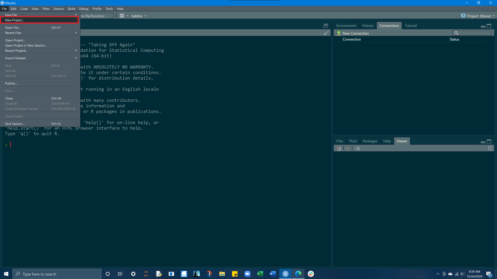

---


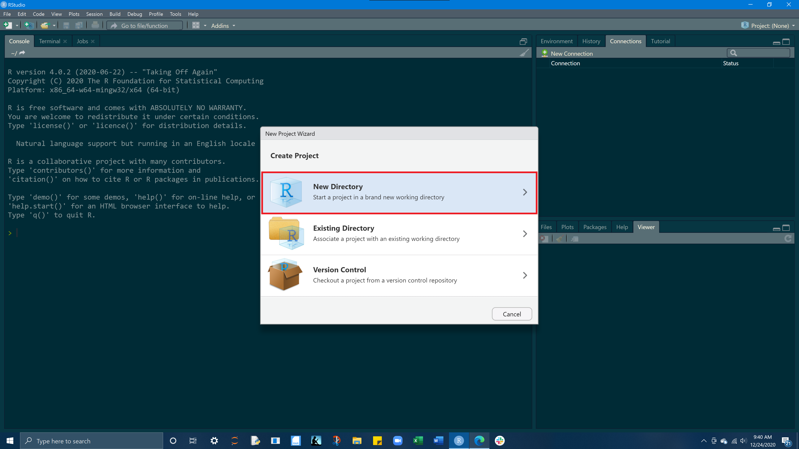

---

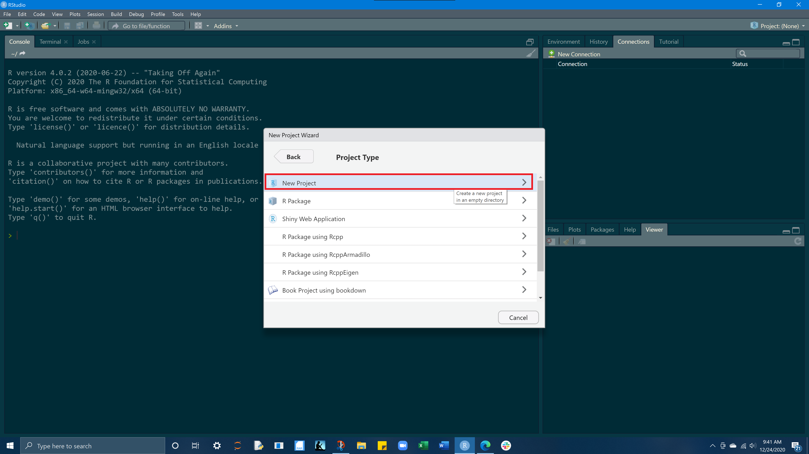

---

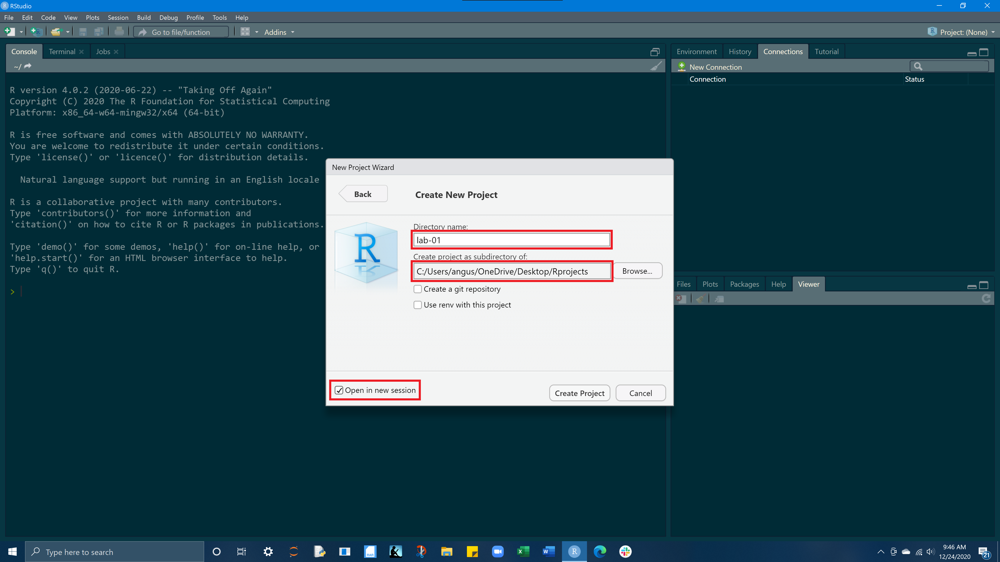

---


---


---


---


---


---

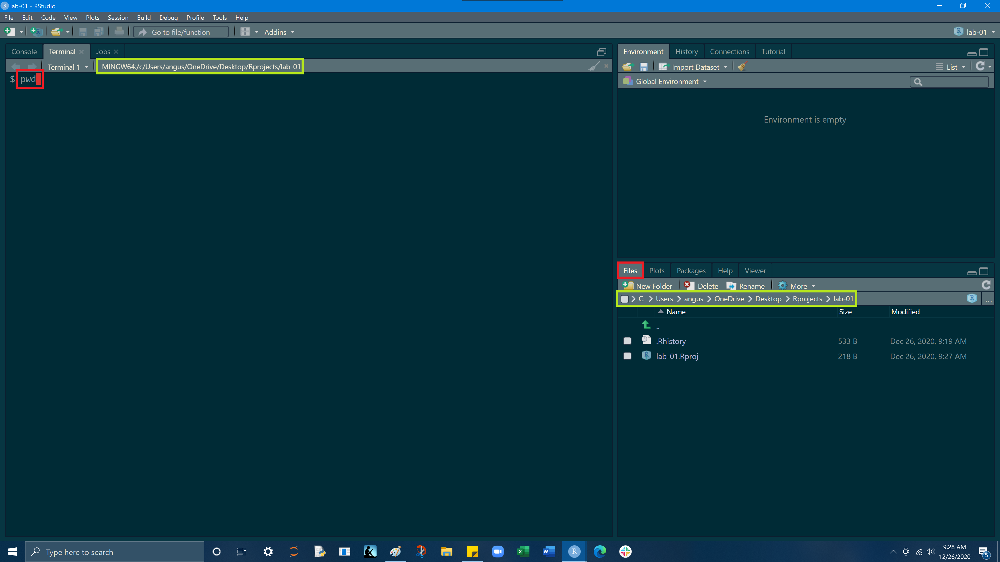

---

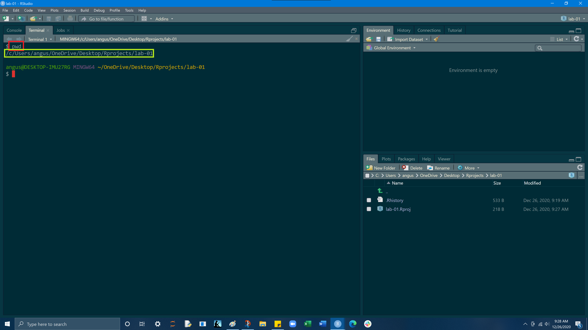

---

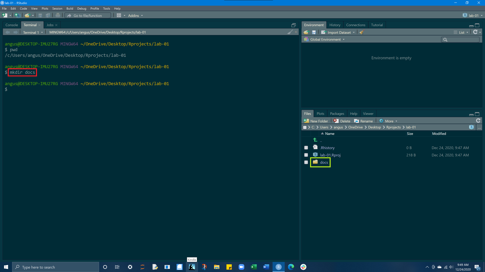

---

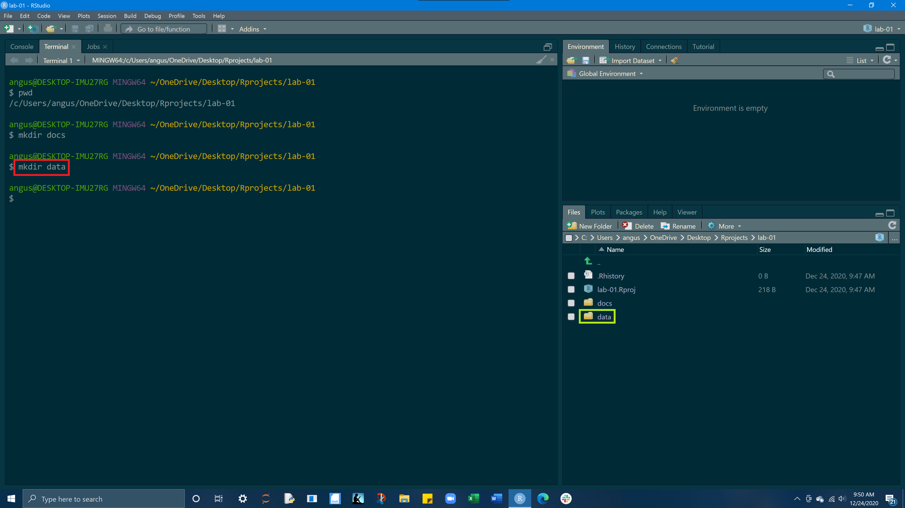

---

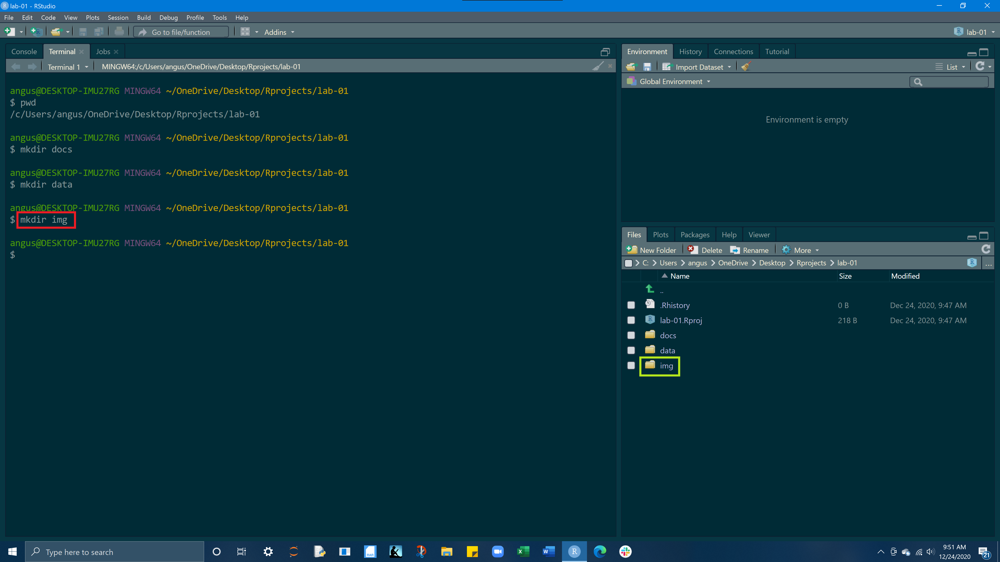

---

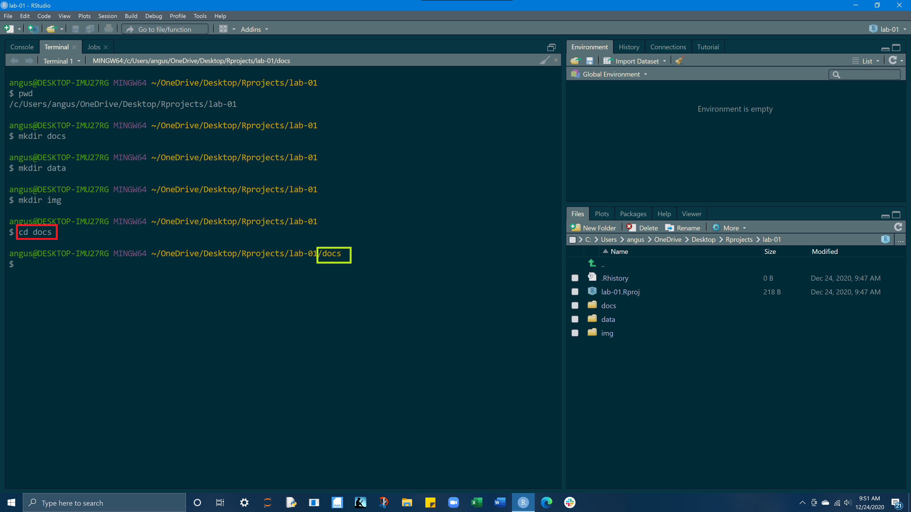

---

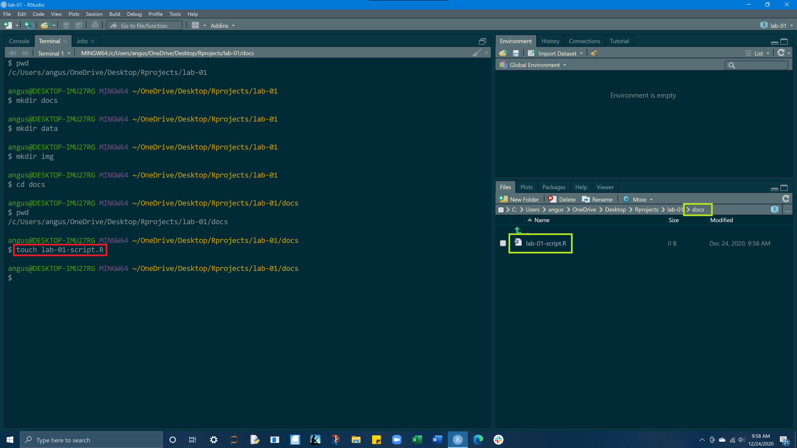

---

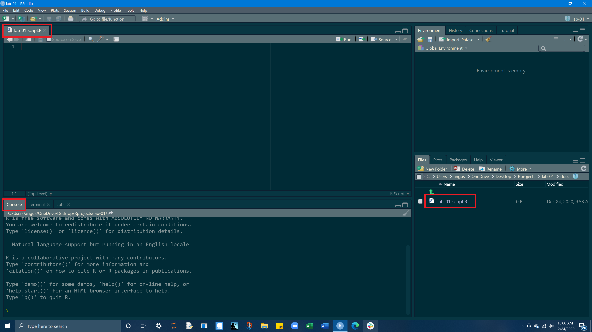

---


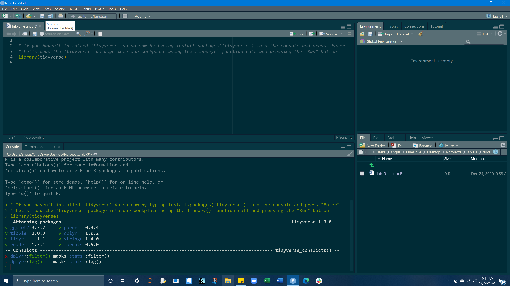


---


--

flipbooks are code-movies.  The frames of the movies are slides. Here we use the R package {xaringan} to create a remark.js slideshow. 

--

Slide breaks are indicated with `---` (be careful trailing white space is not allowed)

--

flipbookr's `chunk_reveal()` disassembles a single code chunk and creates the "build" of multiple partial-code chunks on different slides (the --- is automatically generated for you too).  

--

We use `chunk_reveal()` it 'inline', not in a code chunk. 

--

Let's start!


---
class: inverse, middle, center


# First up: classic flipbook, using defaults to walk through code pipeline


---


